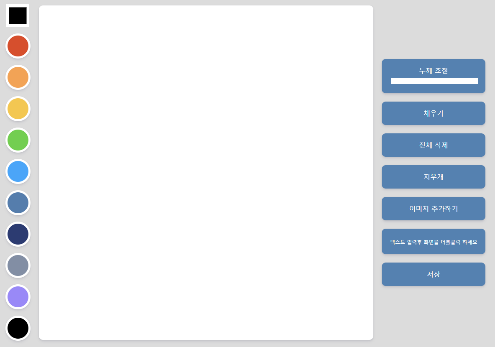

# 🎨 Painting App

자바스크립트를 실제 프로그램 개발에 적용해보기 위한 미니 프로젝트 입니다.

## 📸 App View

<p align="center"></p>

## 🧑‍💻 기술 스택

1. HTML
2. CSS
3. JavaScript

## 🧑‍💻 프로젝트 전 공부한 내용

1. Canvas API
   - JS와 HTML canvas 엘리먼트로 그래픽을 그리기위한 수단을 제공한다.
   - 사용 방법
     - JS로 \<canvas>의 참조를 얻고,
     - HTMLCanvasElement.getContext() 로 드로잉 컨택스트를 얻는다. (2차원 렌더링 컨텍스트 사용)
     ```html
     <!-- HTML -->
     <canvas class="canvas"></canvas>
     ```
     ```javascript
     // JavaScript
     const canvas = document.querySelector(".canvas");
     const ctx = canvas.getContext("2d");
     ```
2. Path (경로)
   - 점들의 집합
   - 선의 한 부분으로 연결되어 여러가지 도형, 곡선을 이루고 두께와 색을 나타낸다.
   - 경로나 하위 경로(sub-path)는 닫힐 수 있다.
3. fillRect()
   - 캔버스에 사각형(rectangle)을 그려준다.
   - 파라미터 : x좌표, y좌표, 너비, 길이
   - 이는 rect() 와 fill() 을 합친 메서드이다.
   ```javascript
   ctx.fillRect(10, 10, 100, 100);
   ```
4. fill(), stroke()
   - stroke() : 선 그리기
   - fill() : 색 채우기
5. moveTo(), lineTo()
   - moveTo() : 경로가 시작될 좌표를 설정한다.
   - lineTo() : 경로가 끝나는 좌표를 설정한다.
6. arc()
   - 원 만들기
   - 파라미터 : x좌표, y좌표, 반지름, 시작 각도, 끝 각도
   ```javascript
   ctx.arc(100, 75, 50, 0, 2 * Math.PI);
   ```
7. beginPath()
   - 이전의 경로를 끊고 새 경로를 만든다.
8. offsetX, offsetY
   - 이벤트 대상 객체에서의 상대적 마우스 x, y좌표 위치를 반환한다.
   - offset : 이벤트가 걸려 있는 DOM객체를 기준으로 좌표를 출력

## ✍🏻 공부한 강의

- [Nomad Coders](https://nomadcoders.co/javascript-for-beginners-2)

## ✍🏻 참고 자료

- [Canvas API](https://developer.mozilla.org/en-US/docs/Web/API/Canvas_API)
- [CanvasRenderingContext2D](https://developer.mozilla.org/en-US/docs/Web/API/CanvasRenderingContext2D)
- [HTMLCanvasElement.getContext()](https://developer.mozilla.org/ko/docs/Web/API/HTMLCanvasElement/getContext)
- [HTMLCanvasElement.arc()](https://www.w3schools.com/tags/canvas_arc.asp)
